# laboratoriti
# Лабораторная работа 10
## Задание A
```python 
from collections import deque
from typing import Any, Deque, Iterable


class Stack:
    """
    Простой стек (LIFO) на базе списка
    Вершина стека — правый край списка
    """

    def __init__(self, items: Iterable[Any] | None = None) -> None:
        """Можно инициализировать готовой последовательностью"""
        self._data: list[Any] = list(items) if items is not None else []

    def push(self, item: Any) -> None:
        """Добавляет элемент на вершину стека"""
        self._data.append(item)

    def pop(self) -> Any:
        """
        Снимает верхний элемент стека
        Поднимает IndexError, если стек пуст
        """
        if self.is_empty():
            raise IndexError("Невозможно выполнить pop: стек пуст")
        return self._data.pop()

    def peek(self) -> Any | None:
        """
        Возвращает верхний элемент без удаления
        Если стек пуст — None
        """
        if self.is_empty():
            return None
        return self._data[-1]

    def is_empty(self) -> bool:
        """True, если стек пуст"""
        return len(self._data) == 0

    def __len__(self) -> int:
        return len(self._data)

    def __repr__(self) -> str:
        return f"Stack({self._data!r})"


class Queue:
    """
    Очередь FIFO на базе collections.deque
    Голова очереди — левый край deque
    """

    def __init__(self, items: Iterable[Any] | None = None) -> None:
        """Можно инициализировать готовой последовательностью"""
        self._data: Deque[Any] = deque(items or [])

    def enqueue(self, item: Any) -> None:
        """Добавляет элемент в конец очереди"""
        self._data.append(item)

    def dequeue(self) -> Any:
        """
        Извлекает элемент из начала очереди
        Поднимает IndexError, если очередь пуста
        """
        if self.is_empty():
            raise IndexError("Невозможно выполнить dequeue: очередь пуста")
        return self._data.popleft()

    def peek(self) -> Any | None:
        """
        Возвращает первый элемент без удаления
        Если очередь пуста — None
        """
        if self.is_empty():
            return None
        return self._data[0]

    def is_empty(self) -> bool:
        """True, если очередь пуста"""
        return len(self._data) == 0

    def __len__(self) -> int:
        return len(self._data)

    def __repr__(self) -> str:
        return f"Queue({list(self._data)!r})"
```
## Звдание B
```python
from typing import Any, Iterator, Optional


class Node:
    """Узел односвязного списка"""

    def __init__(self, value: Any, next: Optional["Node"] = None) -> None:
        self.value = value
        self.next = next

    def __repr__(self) -> str:
        return f"Node({self.value!r})"


class SinglyLinkedList:
    """
    Односвязный список
    Поддерживает добавление в конец или вначало, вставку по индексу и удаление по индексу
    """

    def __init__(self) -> None:
        self.head: Optional[Node] = None
        self.tail: Optional[Node] = None
        self._size: int = 0

    def append(self, value: Any) -> None:
        """Добавить элемент в конец списка за O(1) с учётом tail"""
        new_node = Node(value)
        if self.head is None:
            self.head = self.tail = new_node
        else:
            assert self.tail is not None  # для типа
            self.tail.next = new_node
            self.tail = new_node
        self._size += 1

    def prepend(self, value: Any) -> None:
        """Добавить элемент в начало списка за O(1)"""
        new_node = Node(value, next=self.head)
        self.head = new_node
        if self.tail is None:
            self.tail = new_node
        self._size += 1

    def insert(self, idx: int, value: Any) -> None:
        """
        Вставить элемент по индексу
        Допустимы idx == 0 (в начало) и idx == len(list) (в конец)
        """
        if idx < 0 or idx > self._size:
            raise IndexError("Индекс вне диапазона")
        if idx == 0:
            self.prepend(value)
            return
        if idx == self._size:
            self.append(value)
            return

        prev = self._node_at(idx - 1)
        new_node = Node(value, next=prev.next)
        prev.next = new_node
        self._size += 1

    def remove_at(self, idx: int) -> None:
        """Удалить элемент по индексу. Поднимает IndexError при неверном индексе"""
        if idx < 0 or idx >= self._size:
            raise IndexError("Индекс вне диапазона")

        if idx == 0:
            assert self.head is not None
            self.head = self.head.next
            if self.head is None:
                self.tail = None
            self._size -= 1
            return

        prev = self._node_at(idx - 1)
        assert prev.next is not None
        to_remove = prev.next
        prev.next = to_remove.next
        if prev.next is None:
            self.tail = prev
        self._size -= 1

    def _node_at(self, idx: int) -> Node:
        """Возвращает узел по индексу (внутренний помощник, без проверок границ)"""
        current = self.head
        for _ in range(idx):
            assert current is not None  # для mypy/pyright
            current = current.next
        assert current is not None
        return current

    def __iter__(self) -> Iterator[Any]:
        current = self.head
        while current is not None:
            yield current.value
            current = current.next

    def __len__(self) -> int:
        return self._size

    def __repr__(self) -> str:
        values = ", ".join(repr(v) for v in self)
        return f"SinglyLinkedList([{values}])"
```
### deque
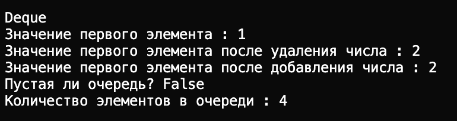
### singly
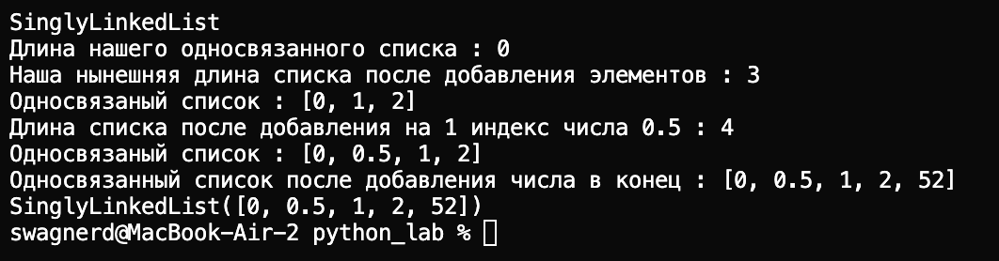
### stack 
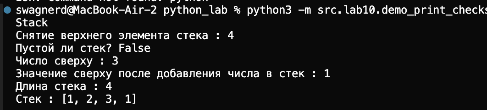
# Лабораторная работа 9 
## Задание A
```python
import csv
from pathlib import Path
from typing import List
import sys

try:
    from src.lab08.models import Student
except (ImportError, ValueError):
    project_root = Path(__file__).parent.parent.parent
    sys.path.insert(0, str(project_root))
    from src.lab08.models import Student


class Group:

    def __init__(self, storage_path: str):
        self.path = Path(storage_path)
        '''Создание файла, если его нет '''
        self._ensure_storage_exists()

    def _ensure_storage_exists(self):
        """Создаем файл с заголовком, если его ещё нет"""
        if not self.path.exists():
            with open(self.path, "w", encoding="utf-8", newline="") as f:
                writer = csv.DictWriter(f, fieldnames=["fio", "birthdate", "group", "gpa"])
                writer.writeheader()

    def _read_all(self) -> List[dict]:
        """
        Читаем все строки из CSV.
        """
        if not self.path.exists():
            return []
        
        rows = []
        with open(self.path, "r", encoding="utf-8", newline="") as f:
            reader = csv.DictReader(f)
            """Если нет заголовка"""
            if reader.fieldnames != ["fio", "birthdate", "group", "gpa"]:
                raise ValueError("Неверный формат CSV: отсутствует или неверный заголовок")
            
            for row in reader:
                # Пропускаем пустые строки
                if any(row.values()):
                    # Конвертируем gpa в float
                    if "gpa" in row and row["gpa"]:
                        try:
                            row["gpa"] = float(row["gpa"])
                        except ValueError:
                            raise ValueError(f"Неверное значение gpa: {row['gpa']}")
                    rows.append(row)
        
        return rows

    def _write_all(self, rows: List[dict]):
        with open(self.path, "w", encoding="utf-8", newline="") as f:
            writer = csv.DictWriter(f, fieldnames=["fio", "birthdate", "group", "gpa"])
            writer.writeheader()
            writer.writerows(rows)

    def list(self) -> List[Student]:
        rows = self._read_all()
        students = []
        for i, row in enumerate(rows):
            try:
                student = Student.from_dict(row)
                students.append(student)
            except (KeyError, ValueError) as e:
                raise ValueError(f"Ошибка при создании Student из строки {i + 2}: {e}")
        return students

    def add(self, student: Student):
        rows = self._read_all()
        # Преобразуем Student в словарь и добавляем
        student_dict = student.to_dict()
        rows.append(student_dict)
        self._write_all(rows)

    def find(self, substr: str) -> List[Student]:
        """
        Найти студентов по подстроке в fio
        """
        rows = self._read_all()
        matching_rows = [r for r in rows if substr.lower() in r["fio"].lower()]
        
        students = []
        for row in matching_rows:
            try:
                student = Student.from_dict(row)
                students.append(student)
            except (KeyError, ValueError) as e:
                raise ValueError(f"Ошибка при создании Student: {e}")
        
        return students

    def remove(self, fio: str):
        """
        Удалить запись(и) с данным fio.
        """
        rows = self._read_all()
        # Удаляем все записи с совпадающим fio
        rows = [r for r in rows if r["fio"] != fio]
        self._write_all(rows)

    def update(self, fio: str, **fields):
        """
        Обновить поля студента
        """
        rows = self._read_all()
        updated = False
        
        for row in rows:
            if row["fio"] == fio:
                for key, value in fields.items():
                    if key in ["fio", "birthdate", "group", "gpa"]:
                        # Конвертируем gpa в float, если передано как строка
                        if key == "gpa" and isinstance(value, str):
                            try:
                                value = float(value)
                            except ValueError:
                                raise ValueError(f"Неверное значение gpa: {value}")
                        row[key] = value
                    else:
                        raise ValueError(f"Неизвестное поле: {key}")
                try:
                    Student.from_dict(row)
                except (KeyError, ValueError) as e:
                    raise ValueError(f"Ошибка валидации обновлённых данных: {e}")
                
                updated = True
                break
        
        if not updated:
            raise ValueError(f"Студент с ФИО '{fio}' не найден")
        
        self._write_all(rows)


# if __name__ == '__main__':
    
#     #Создаём группу
#     group = Group('data/lab09/students.csv')
    
    # Проверяем начальное состояние
    # students = group.list()
    # for s in students:
    #     print(f"- {s}")
    
    # Добавляем студентов
    # students_to_add = [
    #     Student("Иванов Питер", "2003-10-10", "БИВТ-21-1", 4.3),
    #     Student("Петров Петр", "2002-05-20", "SE-01", 4.5),
    #     Student("Вмнокурова Анастасия", "2004-03-15", "БИВТ-21-1", 4.8),
    # ]
    
    # for student in students_to_add:
    #     group.add(student)
    
    # #Получаем список всех студентов
    # all_students = group.list()
    # for i, student in enumerate(all_students, 1):
    #     print(f"{i}. {student}")
    
    # Поиск студентов
    # found = group.find("Иванов")
    # for student in found:
    #     print(f"Найден: {student}")
    
    # #Обновление данных
    # group.update("Иванов Иван", gpa=4.9)
    # # Используем точный поиск по полному ФИО, а не по подстроке
    # updated_student = group.find("Иванов Иван")[0]
    # print(f"Обновлён: {updated_student}")
    
    # #Финальный список
    # final_students = group.list()
    # for i, student in enumerate(final_students, 1):
    #     print(f"{i}. {student}")
    
    # #Удаление студента
    # group.remove("Петров Петр")

    
    # #Список после удаления
    # remaining = group.list()
    # for i, student in enumerate(remaining, 1):
    #     print(f"{i}. {student}")
```
### Исходник csv
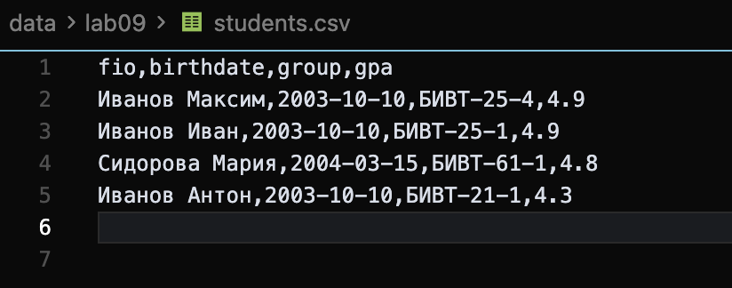
### Исходник терминал 
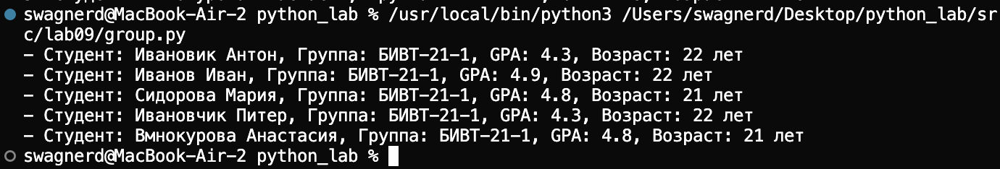
### add
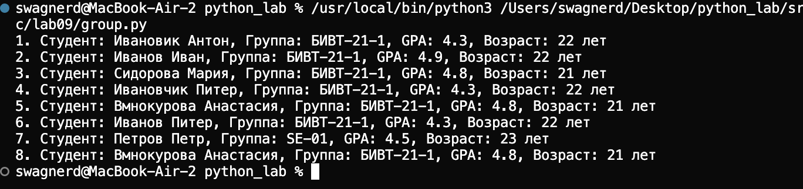
### find
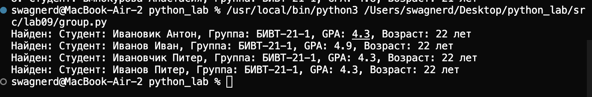
### delete

### update 
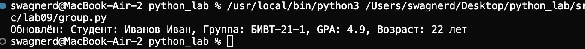
# Лаборатораня работа 8
## Задание A
```python
from dataclasses import dataclass
from datetime import datetime, date


@dataclass
class Student:
    fio: str
    birthdate: str
    group: str
    gpa: float

    def __post_init__(self):
        """Валидация формата даты и диапазона gpa"""
        try:
            datetime.strptime(self.birthdate, "%Y-%m-%d")
        except ValueError:
            raise ValueError("Неверный формат даты")
        
        if not (0 <= self.gpa <= 5):
            raise ValueError("gpa должен быть от 0 до 5")

    def age(self) -> int:
        """Возвращает количество полных лет студента"""
        birth_date = datetime.strptime(self.birthdate, "%Y-%m-%d").date()
        today = date.today()
        age = today.year - birth_date.year
        
        """Проверка на др в этом году"""
        if today.month < birth_date.month or (today.month == birth_date.month and today.day < birth_date.day):
            age -= 1
        
        return age

    def to_dict(self) -> dict:
        """Сериализация объекта Student в словарь"""

        name_parts = self.fio.strip().split()
        name_surname = " ".join(name_parts[:2]) if len(name_parts) >= 2 else self.fio
        
        return {
            "fio": name_surname,
            "birthdate": self.birthdate,
            "group": self.group,
            "gpa": self.gpa
        }

    @classmethod
    def from_dict(cls, d: dict):
        """Десериализация словаря в объект Student"""
        return cls(
            fio=d["fio"],
            birthdate=d["birthdate"],
            group=d["group"],
            gpa=d["gpa"]
        )

    def __str__(self):
        """Красивый вывод информации о студенте"""
        return f"Студент: {self.fio}, Группа: {self.group}, GPA: {self.gpa}, Возраст: {self.age()} лет"


if __name__ == "__main__":
    student = Student(
        fio="Виноградов Антон Зумерович",
        birthdate="2006-05-15",
        group="BBIT-06-1",
        gpa=4.5
    )
    print(student)
    print(f"Словарь: {student.to_dict()}")
```
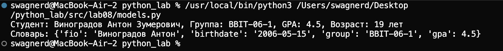

## Задание B
```python
import json
import sys
from pathlib import Path
from typing import List

try:
    from .models import Student
except (ImportError, ValueError):
    
    project_root = Path(__file__).parent.parent.parent
    sys.path.insert(0, str(project_root))
    from src.lab08.models import Student


def students_to_json(students: List[Student], path: str) -> None:
    """
    Сохраняет список студентов в JSON файл.
    """
    data = [s.to_dict() for s in students]
    
    try:
        with open(path, "w", encoding="utf-8") as f:
            json.dump(data, f, ensure_ascii=False, indent=2)
    except IOError as e:
        raise IOError(f"Ошибка при записи файла: {e}")


def students_from_json(path: str) -> List[Student]:
    """
    Читает JSON-массив, валидирует данные и создаёт список Student.
    """
    try:
        with open(path, "r", encoding="utf-8") as f:
            data = json.load(f)
    except FileNotFoundError:
        raise FileNotFoundError(f"Файл не найден: {path}")
    except json.JSONDecodeError as e:
        raise ValueError(f"Неверный формат JSON: {e}")
    
    if not isinstance(data, list):
        raise ValueError("JSON должен содержать список объектов")
    
    students = []
    for i, item in enumerate(data):
        if not isinstance(item, dict):
            raise ValueError(f"Элемент {i} должен быть словарём")
            
        try:
            student = Student.from_dict(item)
            students.append(student)
        except (KeyError, ValueError) as e:
            raise ValueError(f"Ошибка при создании Student из элемента {i}: {e}")
    
    return students


if __name__ == "__main__":

    from pathlib import Path
    
    project_root = Path(__file__).parent.parent.parent
    input_path = project_root / "data" / "lab08" / "students_input.json"
    output_path = project_root / "data" / "lab08" / "students_output.json"
    
    students = students_from_json(str(input_path))
    
    for student in students:
        print(f"• {student}")
    
    students_to_json(students, str(output_path))
```
### Исходный json
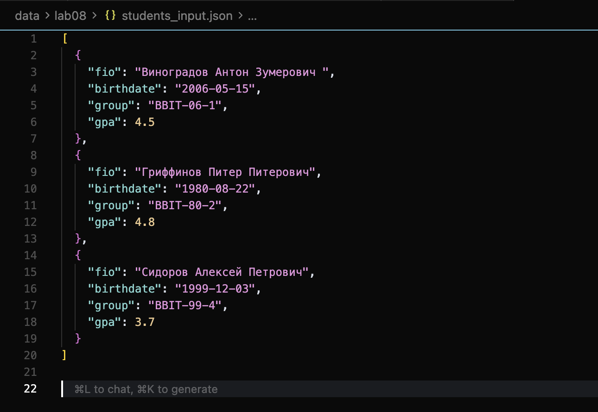
### Выходной json
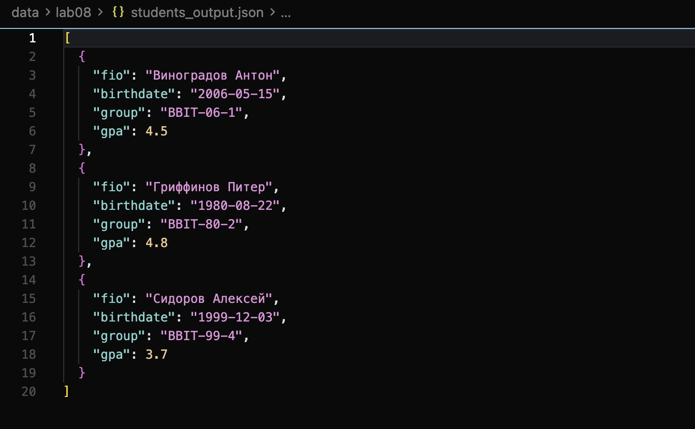
# Лаборатораня работа 7 
## Задание A
```python 
import pytest
from src.lib.text import normalize, tokenize, count_freq, top_n


"""Базовые случаи"""
@pytest.mark.parametrize(
    "source, expected",
    [
        ("ПрИвЕт\nМИр\t", "привет мир"),
        ("ёжик, Ёлка", "ежик, елка"),
        ("Hello\r\nWorld", "hello world"),
        ("  двойные   пробелы  ", "двойные пробелы"),
    ],
)
def test_normalize_basic(source, expected):
    assert normalize(source) == expected


"""Пустая строка"""
def test_normalize_empty_string():
    assert normalize("") == ""


"""Только пробелы"""
def test_normalize_whitespace_only():
    assert normalize("   \t\n\r   ") == ""


"""Нормализация чисел"""
@pytest.mark.parametrize(
    "text, expected",
    [
        ("test123", "test123"),
        ("123test", "123test"),
        ("abc def", "abc def"),
    ],
)
def test_normalize_with_numbers(text, expected):
    assert normalize(text) == expected


"""Сохранение спецсимволов и пунктуации"""
def test_normalize_special_characters():
    assert normalize("hello, world!") == "hello, world!"
    assert normalize("test@email.com") == "test@email.com"


"""yo2e=False"""
def test_normalize_with_yo2e_false():
    assert normalize("ёжик", yo2e=False) == "ёжик"


"""casefold=False"""
def test_normalize_with_casefold_false():
    assert normalize("ПрИвЕт", casefold=False) == "ПрИвЕт"
    assert normalize("Hello", casefold=False) == "Hello"


"""Базовые случаи токенизации"""
@pytest.mark.parametrize(
    "text, expected",
    [
        ("привет мир", ["привет", "мир"]),
        ("hello,world!!!", ["hello", "world"]),
        ("по-настоящему круто", ["по-настоящему", "круто"]),
        ("2025 год", ["2025", "год"]),
    ],
)
def test_tokenize_basic(text, expected):
    assert tokenize(text) == expected


"""Пустая строка"""
def test_tokenize_empty_string():
    assert tokenize("") == []


"""Только знаки препинания"""
def test_tokenize_only_punctuation():
    assert tokenize("!@#$%^&*()") == []


"""Токенизация с подчеркиваниями"""
def test_tokenize_with_underscores():
    assert tokenize("hello_world test_case") == ["hello_world", "test_case"]


"""Множественные пробелы между словами"""
def test_tokenize_multiple_spaces():
    assert tokenize("hello     world") == ["hello", "world"]


"""Токенизация слов с дефисами"""
def test_tokenize_with_hyphens():
    assert tokenize("self-driving-car") == ["self-driving-car"]
    assert tokenize("-start middle- end-") == ["start", "middle-", "end-"]


"""Смешанные символы"""
def test_tokenize_mixed_content():
    assert tokenize("test123 hello456world") == ["test123", "hello456world"]


"""Перенос строк и табуляция"""
def test_tokenize_newlines_and_tabs():
    assert tokenize("hello\nworld\ttest") == ["hello", "world", "test"]


"""Базовый случай подсчета частот"""
def test_count_freq_basic():
    tokens = ["a", "b", "a", "c", "b", "a"]
    expected = {"a": 3, "b": 2, "c": 1}
    assert count_freq(tokens) == expected


"""Пустой список"""
def test_count_freq_empty_list():
    """Граничный случай: пустой список"""
    assert count_freq([]) == {}


"""Один токен"""
def test_count_freq_single_token():
    assert count_freq(["hello"]) == {"hello": 1}


"""Все токены одинаковые"""
def test_count_freq_all_same():
    tokens = ["test", "test", "test", "test"]
    assert count_freq(tokens) == {"test": 4}


"""Все токены уникальные"""
def test_count_freq_all_unique():
    tokens = ["a", "b", "c", "d", "e"]
    expected = {"a": 1, "b": 1, "c": 1, "d": 1, "e": 1}
    assert count_freq(tokens) == expected


"""Подсчет частот с числами"""
def test_count_freq_with_numbers():
    tokens = ["123", "abc", "123", "abc", "123"]
    expected = {"123": 3, "abc": 2}
    assert count_freq(tokens) == expected


"""Базовый случай: топ-N по частоте"""
def test_top_n_basic():
    freq = {"apple": 5, "banana": 3, "cherry": 8, "date": 2}
    result = top_n(freq, n=2)
    assert result == [("cherry", 8), ("apple", 5), ("banana", 3), ("date", 2)]


"""Сортировка по алфавиту при одинаковой частоте"""
def test_top_n_tie_breaker():
    freq = {"bb": 2, "aa": 2, "cc": 3}
    result = top_n(freq, n=10)
    assert result == [("cc", 3), ("aa", 2), ("bb", 2)]


"""Пустой словарь"""
def test_top_n_empty_dict():
    assert top_n({}, n=5) == []


"""Один элемент в словаре"""
def test_top_n_single_item():
    assert top_n({"test": 10}, n=5) == [("test", 10)]


"""Все элементы с одинаковой частотой"""
def test_top_n_all_same_frequency():
    freq = {"dog": 1, "cat": 1, "bird": 1, "ant": 1}
    result = top_n(freq, n=10)
    assert result == [("ant", 1), ("bird", 1), ("cat", 1), ("dog", 1)]


"""Когда n больше количества элементов"""
def test_top_n_returns_all_when_n_larger():
    freq = {"a": 1, "b": 2}
    result = top_n(freq, n=100)
    assert len(result) == 2
    assert result == [("b", 2), ("a", 1)]


"""Смесь частот и алфавита"""
def test_top_n_complex_sorting():
    freq = {"z": 5, "a": 5, "m": 5, "b": 3, "y": 3, "c": 1}
    result = top_n(freq, n=10)
    assert result == [("a", 5), ("m", 5), ("z", 5), ("b", 3), ("y", 3), ("c", 1)]
```


## Задание B
```python 
import pytest
import json
import csv
from pathlib import Path
from src.lab05.json_csv import json_to_csv, csv_to_json

"""Базовая конвертация JSON -> CSV"""
def test_json_to_csv_basic(tmp_path: Path):
    src = tmp_path / "people.json"
    dst = tmp_path / "people.csv"

    data = [
        {"name": "Alice", "age": "22"},
        {"name": "Bob", "age": "25"},
    ]
    src.write_text(json.dumps(data, ensure_ascii=False, indent=2), encoding="utf-8")

    json_to_csv(str(src), str(dst))

    with dst.open(encoding="utf-8") as f:
        rows = list(csv.DictReader(f))

    assert len(rows) == 2
    assert {"name", "age"} <= set(rows[0].keys())
    assert rows[0]["name"] == "Alice"
    assert rows[0]["age"] == "22"
    assert rows[1]["name"] == "Bob"
    assert rows[1]["age"] == "25"


"""Конвертация с множественными полями"""
def test_json_to_csv_multiple_fields(tmp_path: Path):
    src = tmp_path / "data.json"
    dst = tmp_path / "data.csv"

    data = [
        {"id": "1", "name": "John", "city": "Moscow", "salary": "50000"},
        {"id": "2", "name": "Jane", "city": "Paris", "salary": "60000"},
        {"id": "3", "name": "Jack", "city": "London", "salary": "55000"},
    ]
    src.write_text(json.dumps(data, ensure_ascii=False, indent=2), encoding="utf-8")

    json_to_csv(str(src), str(dst))

    with dst.open(encoding="utf-8") as f:
        rows = list(csv.DictReader(f))

    assert len(rows) == 3
    assert {"id", "name", "city", "salary"} <= set(rows[0].keys())


"""Тест формата (UTF-8)"""
def test_json_to_csv_cyrillic(tmp_path: Path):
    src = tmp_path / "russian.json"
    dst = tmp_path / "russian.csv"

    data = [
        {"имя": "Алексей", "возраст": "30"},
        {"имя": "Мария", "возраст": "28"},
    ]
    src.write_text(json.dumps(data, ensure_ascii=False, indent=2), encoding="utf-8")

    json_to_csv(str(src), str(dst))

    with dst.open(encoding="utf-8") as f:
        rows = list(csv.DictReader(f))

    assert len(rows) == 2
    assert rows[0]["имя"] == "Алексей"
    assert rows[1]["имя"] == "Мария"


"""Файл не существует"""
def test_json_to_csv_file_not_found(tmp_path: Path):
    src = tmp_path / "nonexistent.json"
    dst = tmp_path / "output.csv"

    with pytest.raises(FileNotFoundError):
        json_to_csv(str(src), str(dst))


"""Некорректный JSON"""
def test_json_to_csv_invalid_json(tmp_path: Path):
    src = tmp_path / "invalid.json"
    dst = tmp_path / "output.csv"

    src.write_text("{ this is not valid json }", encoding="utf-8")

    with pytest.raises(ValueError):
        json_to_csv(str(src), str(dst))


"""Пустой JSON"""
def test_json_to_csv_empty_file(tmp_path: Path):
    src = tmp_path / "empty.json"
    dst = tmp_path / "output.csv"

    src.write_text("[]", encoding="utf-8")

    with pytest.raises(ValueError, match="пуст"):
        json_to_csv(str(src), str(dst))


"""JSON не является списком"""
def test_json_to_csv_not_list(tmp_path: Path):
    src = tmp_path / "notlist.json"
    dst = tmp_path / "output.csv"

    data = {"name": "Alice", "age": 22}
    src.write_text(json.dumps(data), encoding="utf-8")

    with pytest.raises(ValueError, match="список"):
        json_to_csv(str(src), str(dst))


"""Элементы списка не словари"""
def test_json_to_csv_not_dict_elements(tmp_path: Path):
    src = tmp_path / "notdict.json"
    dst = tmp_path / "output.csv"

    data = ["string1", "string2", "string3"]
    src.write_text(json.dumps(data), encoding="utf-8")

    with pytest.raises(ValueError, match="словарями"):
        json_to_csv(str(src), str(dst))


"""Неверное расширение файла"""
def test_json_to_csv_wrong_extension(tmp_path: Path):

    src = tmp_path / "file.txt"
    dst = tmp_path / "output.csv"

    with pytest.raises(TypeError, match="расширение"):
        json_to_csv(str(src), str(dst))


"""Неверное расширение для CSV"""
def test_json_to_csv_wrong_csv_extension(tmp_path: Path):
    src = tmp_path / "file.json"
    dst = tmp_path / "output.txt"

    src.write_text('[{"name": "test"}]', encoding="utf-8")

    with pytest.raises(TypeError, match="расширение"):
        json_to_csv(str(src), str(dst))


"""Базовая конвертация CSV -> JSON"""
def test_csv_to_json_basic(tmp_path: Path):

    src = tmp_path / "people.csv"
    dst = tmp_path / "people.json"

    with src.open("w", encoding="utf-8", newline="") as f:
        writer = csv.DictWriter(f, fieldnames=["name", "age"])
        writer.writeheader()
        writer.writerow({"name": "Alice", "age": "22"})
        writer.writerow({"name": "Bob", "age": "25"})

    csv_to_json(str(src), str(dst))

    with dst.open(encoding="utf-8") as f:
        data = json.load(f)

    assert len(data) == 2
    assert data[0]["name"] == "Alice"
    assert data[0]["age"] == "22"
    assert data[1]["name"] == "Bob"
    assert data[1]["age"] == "25"


"""Конвертация CSV с множественными полями"""
def test_csv_to_json_multiple_fields(tmp_path: Path):
    src = tmp_path / "data.csv"
    dst = tmp_path / "data.json"

    with src.open("w", encoding="utf-8", newline="") as f:
        writer = csv.DictWriter(f, fieldnames=["id", "name", "city", "salary"])
        writer.writeheader()
        writer.writerow(
            {"id": "1", "name": "John", "city": "Moscow", "salary": "50000"}
        )
        writer.writerow({"id": "2", "name": "Jane", "city": "Paris", "salary": "60000"})

    csv_to_json(str(src), str(dst))

    with dst.open(encoding="utf-8") as f:
        data = json.load(f)

    assert len(data) == 2
    assert set(data[0].keys()) == {"id", "name", "city", "salary"}


"""Тест UTF-8"""
def test_csv_to_json_cyrillic(tmp_path: Path):
    src = tmp_path / "russian.csv"
    dst = tmp_path / "russian.json"

    with src.open("w", encoding="utf-8", newline="") as f:
        writer = csv.DictWriter(f, fieldnames=["имя", "возраст"])
        writer.writeheader()
        writer.writerow({"имя": "Алексей", "возраст": "30"})
        writer.writerow({"имя": "Мария", "возраст": "28"})

    csv_to_json(str(src), str(dst))

    with dst.open(encoding="utf-8") as f:
        data = json.load(f)

    assert len(data) == 2
    assert data[0]["имя"] == "Алексей"
    assert data[1]["имя"] == "Мария"


"""Файл не существует"""
def test_csv_to_json_file_not_found(tmp_path: Path):
    src = tmp_path / "nonexistent.csv"
    dst = tmp_path / "output.json"

    with pytest.raises(FileNotFoundError):
        csv_to_json(str(src), str(dst))


"""Пустой CSV файл"""
def test_csv_to_json_empty_file(tmp_path: Path):
    src = tmp_path / "empty.csv"
    dst = tmp_path / "output.json"

    src.write_text("", encoding="utf-8")

    with pytest.raises(ValueError, match="пуст"):
        csv_to_json(str(src), str(dst))


"""Только заголовок без данных"""
def test_csv_to_json_only_header(tmp_path: Path):
    src = tmp_path / "header_only.csv"
    dst = tmp_path / "output.json"

    with src.open("w", encoding="utf-8", newline="") as f:
        writer = csv.DictWriter(f, fieldnames=["name", "age"])
        writer.writeheader()

    with pytest.raises(ValueError, match="пуст"):
        csv_to_json(str(src), str(dst))


"""Неверное расширение файла"""
def test_csv_to_json_wrong_extension(tmp_path: Path):

    src = tmp_path / "file.txt"
    dst = tmp_path / "output.json"

    with pytest.raises(TypeError, match="расширение"):
        csv_to_json(str(src), str(dst))


"""Неверное расширение для JSON"""
def test_csv_to_json_wrong_json_extension(tmp_path: Path):
    src = tmp_path / "file.csv"
    dst = tmp_path / "output.txt"

    src.write_text("name,age\ntest,25", encoding="utf-8")

    with pytest.raises(TypeError, match="расширение"):
        csv_to_json(str(src), str(dst))
```
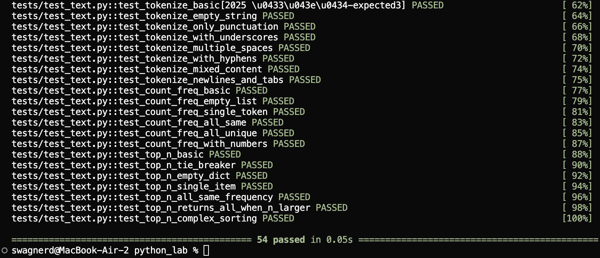
## Задание C 
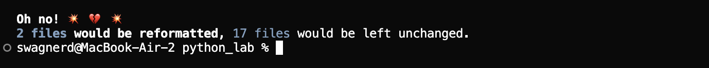
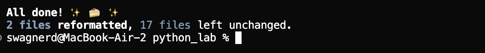
# Лабораторная работа 6
## Задание 1
```python
import argparse
import os
import sys
from pathlib import Path

sys.path.append(os.path.abspath(os.path.join(os.path.dirname(__file__), '..')))
from lab04.text_report import frequencies_from_text, sorted_word

def main():
    parser = argparse.ArgumentParser(description="CLI‑утилиты лабораторной №6")
    subparsers = parser.add_subparsers(dest="command")

    cat_pars = subparsers.add_parser("cat", help="Вывести содержимое файла")
    cat_pars.add_argument("--input", required=True, help='Путь к фходному файлу')
    cat_pars.add_argument("-n", action="store_true", help="Нумеровать строки")
    
    stats_pars = subparsers.add_parser("stats", help="Частоты слов")  
    stats_pars.add_argument("--input", required=True)
    stats_pars.add_argument("--top", type=int, default=5)

    args = parser.parse_args()

    if args.command == "cat":
        input_path = Path(args.input)
        if not input_path.exists():
            cat_pars.error(f"Файл не найден: '{args.input}'")
        
        try:
            for i, line in enumerate(input_path.read_text(encoding='utf-8').splitlines()):
                print(f"{i + 1}. {line}" if args.n else line)
        except Exception as e:
            cat_pars.error(f"Ошибка при чтении файла: {e}")
            
    elif args.command == "stats":
        if args.top <= 0:
            stats_pars.error(f"--top должен быть положительным числом, получено: {args.top}")
        
        input_path = Path(args.input)
        if not input_path.exists():
            stats_pars.error(f"Файл не найден: '{args.input}'")
        
        try:
            new_str = input_path.read_text(encoding='utf-8')
            sorted_list = sorted_word(frequencies_from_text(new_str))
            for word, count in sorted_list[:args.top]:
                print(f"{word}: {count}")
        
        except Exception as e:
            stats_pars.error(f"Ошибка при обработке файла: {e}")

if __name__ == "__main__":
    main()
```
##cat - вывод строк с номерами 
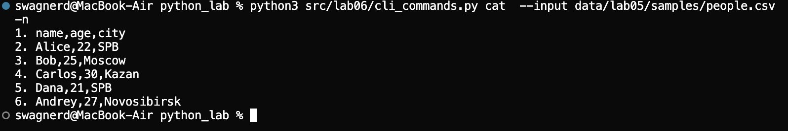
##stats - вывод топ слов файла

## Задание 2 
```python 
import argparse
import os
import sys

sys.path.append(os.path.abspath(os.path.join(os.path.dirname(__file__), '..')))

from lab05.json_csv import json_to_csv, csv_to_json
from lab05.csv_xlsx import csv_to_xlsx

def main():
    parser = argparse.ArgumentParser(description="Конвертеры данных")
    sub = parser.add_subparsers(dest="command")

    parser1 = sub.add_parser("json2csv")
    parser1.add_argument("--in", dest="input", required=True)
    parser1.add_argument("--out", dest="output", required=True)

    parser2 = sub.add_parser("csv2json")
    parser2.add_argument("--in", dest="input", required=True)
    parser2.add_argument("--out", dest="output", required=True)

    p3 = sub.add_parser("csv2xlsx")
    p3.add_argument("--in", dest="input", required=True)
    p3.add_argument("--out", dest="output", required=True)

    args = parser.parse_args()
    if args.command == "json2csv":
        json_to_csv(args.input, args.output)    
    elif args.command == "csv2json":
        csv_to_json(args.input, args.output)
    elif args.command == "csv2xlsx":
        csv_to_xlsx(args.input, args.output)

if __name__ == "__main__":
    main()
```
##file operation
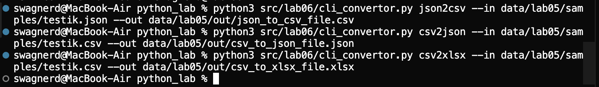

# Лабораторная работа 5
## Задание A
```python 
import json
import csv

def json_to_csv(json_path: str, csv_path: str) -> None:
    """
    Преобразует JSON-файл в CSV.
    Поддерживает список словарей [{...}, {...}], заполняет отсутствующие поля пустыми строками.
    Кодировка UTF-8. Порядок колонок — как в первом объекте или алфавитный (указать в README).
    """
    if not json_path.endswith('.json'): 
        raise TypeError("Неверное расширение(only .json)")
    if not csv_path.endswith('.csv'):
        raise TypeError("Неверное расширение(olnly .csv)")

    try:
        with open(json_path, 'r', encoding='utf-8') as f:
            dannie = json.load(f)
    except FileNotFoundError:
        raise FileNotFoundError("Файл не найден")
    except json.JSONDecodeError as e:
        raise ValueError("Неверный формат оформления")
    

    if not isinstance(dannie, list):
        raise ValueError("JSON должен содержать список объектов")
    if len(dannie) == 0:
        raise ValueError("JSON-файл пуст")
    if not isinstance(dannie[0], dict):
        raise ValueError("Элементы списка должны быть словарями")
    
    zagolovki = list(dannie[0].keys())
    
    try:
        with open(csv_path, 'w', newline='', encoding='utf-8') as csv_file:
            isxod = csv.DictWriter(csv_file, fieldnames=zagolovki)
            isxod.writeheader()
            isxod.writerows(dannie)
    except IOError as e:
        raise IOError(f"Ошибка формата {e}")

json_to_csv('data/lab05/samples/people.json', 'data/lab05/out/people_from_json.csv')


def csv_to_json(csv_path: str, json_path: str) -> None:
    """
    Преобразует CSV в JSON (список словарей).
    Заголовок обязателен, значения сохраняются как строки.
    json.dump(..., ensure_ascii=False, indent=2)
    """
    
    if not csv_path.endswith('.csv'):
        raise TypeError("Неверное расширение(only .csv)")
    if not json_path.endswith('.json'):
        raise TypeError("Неверное расширение(only .json)")
    
    rows = []
    try:
        with open(csv_path, 'r', encoding='utf-8') as csv_file:
            reader = csv.DictReader(csv_file)#читаем словари
            rows = list(reader)
    except FileNotFoundError:
        raise FileNotFoundError("Файл не найден")
  
    if not rows:
        raise ValueError("CSV файл пуст")
    
    try:
        with open(json_path, 'w', encoding='utf-8') as json_file:
            json.dump(rows, json_file, ensure_ascii=False, indent=2)
    except IOError as e:
        raise IOError(f"Ошибка формата {e}")


csv_to_json('data/lab05/samples/testik.csv', 'data/lab05/out/testik.json')
```
### Исходник .json
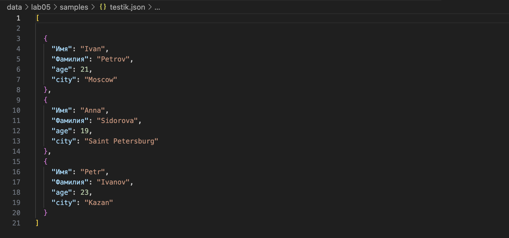
### Результат 
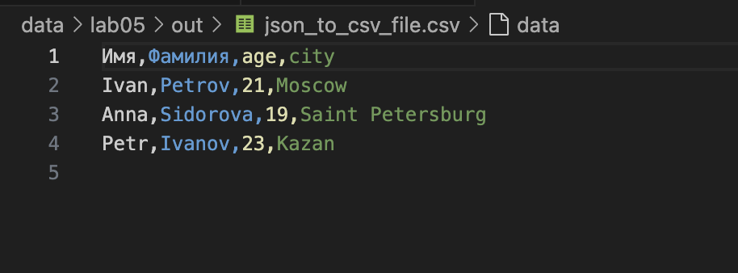
### Исходник .csv
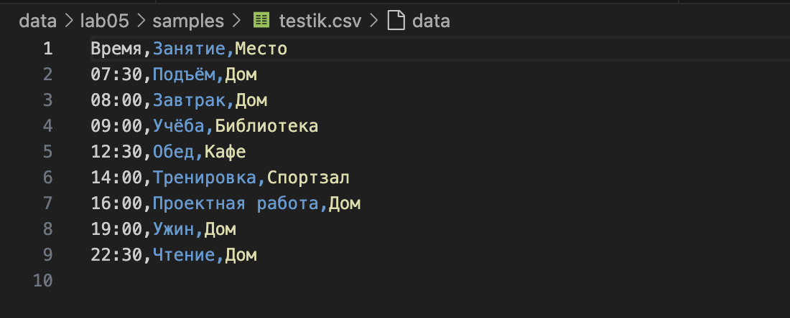
### Результат 
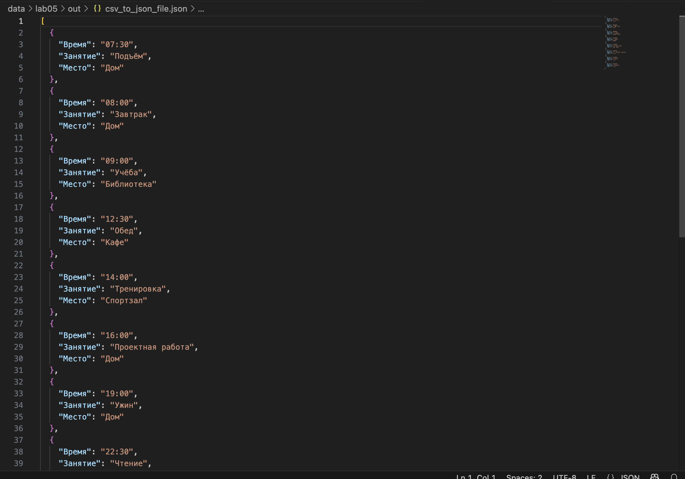

## Задание B
``` python
from openpyxl import Workbook
import csv

def csv_to_xlsx(csv_path: str, xlsx_path: str) -> None:
    """
    Конвертирует CSV в XLSX.
    Использовать openpyxl ИЛИ xlsxwriter.
    Первая строка CSV — заголовок.
    Лист называется "Sheet1".
    Колонки — автоширина по длине текста (не менее 8 символов).
    """
    new_file = Workbook()
    listt = new_file.active
    listt.title = "1"
    
    with open(csv_path, encoding="utf-8") as f:
        for row in csv.reader(f):
                listt.append(row)
        for column in listt.columns:
            mx = 0
            column_letter = column[0].column_letter
            for cell in column:
                mx = max(mx, len(cell.value))
            new_width = max(mx + 2, 8)
            listt.column_dimensions[column_letter].width = new_width
    
    new_file.save(xlsx_path)
csv_to_xlsx('data/lab05/samples/people.csv', 'data/lab05/out/people.xlsx')  
```
### Исходник .csv

### Результат 
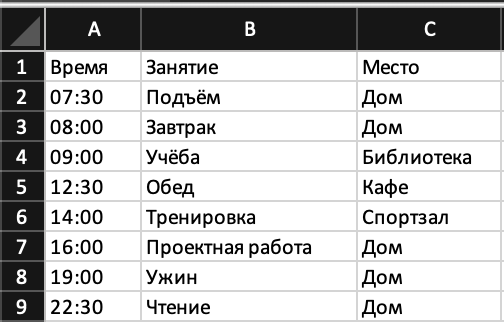

# Лабораторная работа 4
## Задание 1
```python
from pathlib import Path
import csv
from typing import Iterable, Sequence

def read_text(path: str | Path, encoding: str = "utf-8") -> str:
    """
    Читаем текст из файлов в одну строку 
    Чтобы выбрать другую кодировку, просто меняем значение аргумента функции: 
    read_text("...", "cp1251") - заменили utf-8 на cp1251
    """
    p = Path(path)
    return p.read_text(encoding=encoding)
если нужно убрать личшние пробелы return ''.join(p.read_text(encoding=encoding).split())
print(read_text("data/lab04/input.txt"))
print('*'*18)
def write_csv(rows: list[tuple | list], path: str | Path, header: tuple[str, ...] | None = None) -> None:
    """
    Создаем или перезаписываем csv
    + проверка длины строк на входе 
    """
    p = Path(path)
    rows = list(rows)
    for i in rows:
        if len(i) != len(header): raise ValueError
    with p.open("w", newline='', encoding="utf-8") as f:
        w = csv.writer(f)
        if header is not None: w.writerow(header)
        for r in rows: w.writerow(r)


write_csv([("word","count","terk"),("test",3, 6)], "data/lab04/check.csv", 'eet') 
write_csv(rows=[], path="data/lab04/check.csv", header=None)
write_csv(rows=[], path="data/lab04/check.csv", header='F')
```

### print(read_text("data/lab04/input.txt"))
.png)

### write_csv([("word","count"),("test",3)], "data/lab04/check.csv", 'ddg') 
.png)

### write_csv(rows=[], path="data/lab04/check.csv", header=None)
.png)

### write_csv(rows=[], path="data/lab04/check.csv", header='F')
.png)

## Задание 2
```python
import csv
from collections import Counter
from pathlib import Path
import os, sys

sys.path.append(os.path.abspath(os.path.join(os.path.dirname(__file__), '..')))
from lib.text import tokenize, normalize, top_n, count_freq

def read_text(path: str | Path, encoding: str = "utf-8") -> str:
    """
    Читаем текст из файла 
    + обрабатваем несуществующий файл
    """
    try:
        p = Path(path)
        return p.read_text(encoding=encoding)
    except FileNotFoundError:
        print('Файл не существует')
        sys.exit(1)

nova_str = read_text("data/lab04/input.txt") #уместна проверка на txt файл
#arg - подаваемое значение в функцию 
#if arg[-1:-3] == 'txt' or 'csv':
#Проходит условие, можно работать дальше 

def frequencies_from_text(text: str) -> dict[str, int]:
    tokens = tokenize(normalize(text))
    return Counter(tokens) 

def sorted_word(freq: dict[str, int]) -> list[tuple[str, int]]:
    return sorted(freq.items(), key=lambda x: (-x[1], x[0]))

def report_csv(word_counts: list[tuple[str, int]], path: str | Path = "report.csv") -> None:
    """
    Создаем отчет csv файлом
    word_counts: список кортежей 
    path: путь, по которому будет сохраняться отчет csv 
    """
    p = Path(path)
    with p.open("w", newline='', encoding="utf-8") as f:
        l = csv.writer(f)
        l.writerow(("word", "count"))
        for word, count in word_counts:
            l.writerow((word, count))

sorted_list = sorted_word(frequencies_from_text(nova_str))
report_csv(sorted_list, "data/lab04/report.csv")

print(f'Всего слов: {len((nova_str).split())}')
print(f'Уникальных слов: {len(set(tokenize(nova_str)))}')
print(f'Топ-5:')
for word, count in top_n(Counter(tokenize(nova_str)), 5):
    print(f'{word}:{count}')

print(f"Отчет выполнен и сохранен: data/lab04/report.csv")
```
### Консольный отчет (mini)
.png)
### Report 
.png)

# Лабораторная работа 3
## Задание 1 (Функции)
```python
def normalize(text: str, *, casefold: bool = True, yo2e: bool = True) -> str:
    if text == '': return ''
    if casefold: 
        text = text.casefold()
    if yo2e:
        text = text.replace('ё','е').replace('Ё','Е')
    text = ' '.join(text.split())
    return text
print(normalize("ПрИвЕт\nМИр\t"))
print(normalize("ёжик, Ёлка"))
print(normalize("Hello\r\nWorld"))
print(normalize("  двойные   пробелы  "))
print('#'*18)
print(' '*18)

def tokenize(text: str) -> list[str]:
    tokenn = []
    perederz = []
    for simv in text+' ':
        if simv.isalnum() or simv == '_':
            perederz.append(simv)
        elif simv == '-' and len(perederz)>=1 and perederz[-1].isalnum():
            perederz.append(simv)        
        else:
            if len(perederz) >=1:   
                tokenn.append(''.join(perederz))
                perederz = []
    return tokenn 
print(tokenize("привет мир"))
print(tokenize("hello,world!!!"))
print(tokenize("по-настоящему круто"))
print(tokenize("2025 год"))
print(tokenize("emoji 😀 не слово"))
print('#'*18)
print(' '*18)

def count_freq(tokens: list[str]) -> dict[str, int]:
    slovar = {}
    for token in tokens:
        slovar[token] = slovar.get(token,0) +1
    return slovar
print(count_freq(["a","b","a","c","b","a"]))
print('#'*18)
print(' '*18) 

def top_n(freq: dict[str, int], n: int = 5) -> list[tuple[str, int]]:
    res = list(freq.items())
    res.sort(key = lambda i: (-i[1],i[0]))
    return res
print(top_n({"bb":2,"aa":2,"cc":3}))
print('#'*18)
print(' '*18)
```
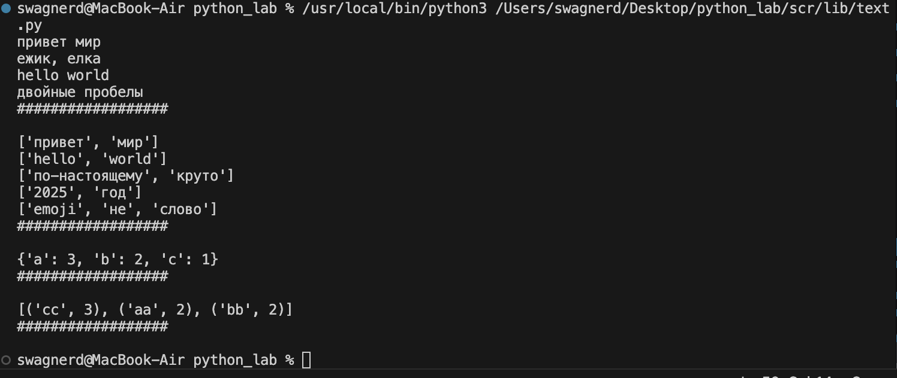

## Задание 2 
```python 
import sys
import os
from pathlib import Path

lib_path = Path(__file__).parent.parent / 'lib'
sys.path.insert(0, str(lib_path))

from text import tokenize, normalize, count_freq, top_n


def read_stdin() -> str:
    return sys.stdin.read()


def stats(colvo_slov: int, unik_slova: int, top_items):
    print(f'Всего слов: {colvo_slov}')
    print(f'Уникальных слов: {unik_slova}')
    print('Топ-5:')
    for word, count in top_items:
        print(f'{word}:{count}')


def main():
    text = read_stdin()
    normalized = normalize(text)
    tokens = tokenize(normalized)
    freq_map = count_freq(tokens)
    top = top_n(freq_map, 5)
    stats(len(tokens), len(set(tokens)), top)


if __name__ == '__main__':
    main()
```
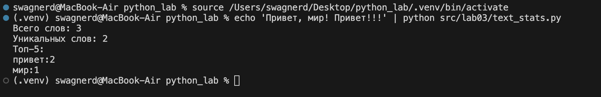


# Лабораторная работа 2
## Задание 1
```python
ddef min_max(nums: list[float | int]) -> tuple[float | int, float | int]:
    if not nums:
        raise ValueError
    return (min(nums), max(nums))
print(min_max([3, -1, 5, 5, 0]))
print(min_max([42]))
print(min_max([-5, -2, -9]))
print(min_max([]))
print(min_max([1.5, 2, 2.0, -3.1]))

print('#'*18)
print('')
def unique_sorted(nums: list[float | int]) -> list[float | int]:
    return sorted(set(nums))
print(unique_sorted([3, 1, 2, 1, 3]))
print(unique_sorted([]))
print(unique_sorted([-1, -1, 0, 2, 2]))
print(unique_sorted([1.0, 1, 2.5, 2.5, 0]))
print('#'*18)
print('')
def flatten(mat: list[list | tuple]) -> list:
    res = []
    for row in mat:
        if not isinstance(row,(list,tuple)):
            raise ValueError
        if isinstance(row,(list,tuple)):
            res.extend(row)
    return res
print(flatten([[1, 2], [3, 4]]))
print(flatten([[1, 2], (3, 4, 5)]))  
print(flatten([[1], [], [2, 3]]))  
print(flatten([[1, 2], "ab"])) 
print('#'*18)
```


## Задание 2
```python
def transpose(mat: list[list[float | int]]) -> list[list]:
    if len(mat) == 0:
        return []
    rvan = [len(x) for x in mat]
    if len(set(rvan))!=1:
        raise ValueError
    return [list(col) for col in zip(*mat)]
print(transpose([[1, 2, 3]]))
print(transpose([[1], [2], [3]]))
print(transpose([[1, 2], [3, 4]]))
print(transpose([]))
print(transpose([[1, 2], [3]]))
print('#'*18)
print('')

def row_sums(mat: list[list[float | int]]) -> list[float]:
    rvan = [len(x) for x in mat]
    if len(set(rvan)) != 1:
        raise ValueError
    res = []
    for i in range(len(mat)):
        summ = 0
        res.append(sum(mat[i]))
    return res
print(row_sums([[1, 2, 3], [4, 5, 6]]))
print(row_sums([[-1, 1], [10, -10]]))
print(row_sums([[0, 0], [0, 0]]))
print(row_sums([[1, 2], [3]]))
print('#'*18,' '*18)
print('')

def col_sums(mat: list[list[float | int]]) -> list[float]:
    rvan = [len(x) for x in mat]
    if len(set(rvan)) != 1:
        raise ValueError
    res = []
    for i in range(len(mat[0])):
        s = 0
        for j in range(len(mat)):
            s+=mat[j][i]
        res.append(s)       
    return res
print(col_sums([[1, 2, 3], [4, 5, 6]]))
print(col_sums([[-1, 1], [10, -10]]))
print(col_sums([[0, 0], [0, 0]]))
print(col_sums([[1, 2], [3]]))
print('#'*18)
```

## Задание 3
```python
def format_record(rec: tuple[str, str, float]) -> str:
    if not isinstance(rec, tuple):
        raise TypeError #Проверка на кортеж
    if len(rec) != 3:
        raise ValueError #Отсутствуют элементы 
    fio, group,gpa = rec
    if  group == '' or gpa > 5 or gpa < 0 or fio == '':
        raise ValueError #Неверные данные(0<gpa<5)
    if not isinstance(gpa,(int,float)) or not isinstance(group,str) or not isinstance(fio,str):
        raise TypeError #Неверный тип данных  
    stroka = ''
    inic = fio.strip().split()
    if len(inic) == 3:
        inic = str(inic[0][0].upper()+inic[0][1::] + ' ' +(inic[1])[:1:].upper()+'.'+ (inic[2])[:1:].upper()+'.')
    else:
        inic = str(inic[0][0].upper()+inic[0][1::]  +' '+(inic[1])[:1:]+'.')    
    grupa = rec[1]
    ball = f'{gpa:.2f}'
    stroka = inic + ', гр. ' + grupa + ', GPA ' + ball 
    return stroka
print(format_record(("Иванов Иван Иванович", "BIVT-25", 4.6)))
print(format_record(("Петров Пётр", "IKBO-12", 5.0)))
print(format_record(("Петров Пётр Петрович", "IKBO-12", 5.0)))
print(format_record(("  сидорова  анна   сергеевна ", "ABB-01", 3.999)))
print(format_record(("IKBO-12", 5.0)))
print(format_record(("Петров Пётр Петрович", 5,4.0)))  
print('#'*18)
```


# Лабораторная работа 1
## Задание 1
```python
name = input('Имя: ')
age = int(input('Возраст: '))
print(f'Привет, {name}! Через год тебе будет {age+1}.')
```


## Задание 2 
```python
a = input('a: ')
b = input('b: ')
a = float(a.replace(',','.'))
b = float(b.replace(',','.'))
print(f'sum={a+b}; avg={((a+b)/2):.2f}')
```


## Задание 3
```python
price = int(input('price='))
discount = int(input('discount='))
vat = int(input('vat='))
base = price * (1-discount/100)
vat_amount = base * (vat/100)
total = base + vat_amount
print(f'База после скидки: {base:.2f} ₽')
print(f'НДС: {vat_amount:20.2f} ₽')
print(f'Итого к оплате: {total:10.2f} ₽')
```


## Задание 4
```python
m = int(input('Минуты: '))
print(f'{m//60}:{m%60:02d}')
```


## Задание 5
```python
fio = input('ФИО: ')
fio = fio.replace(' ','')
iniciali = ''
for i in range(len(fio)):
    bukva = fio[i]
    if bukva.isupper():
        iniciali += bukva
    else:
        continue
print(f'Инициалы: {iniciali}.')
print(f'Длина (символов): {len(fio)+2}')
```


## Задание 6 
```python
kolich = int(input('in_1: '))
ochno_ = 0
zaochno_ = 0
for i in range(kolich):
    ychastnik = input(f'in_{i+2}: ')
    if 'True' in ychastnik:
        ochno_ = ochno_+1
    else:
        zaochno_ = zaochno_ +1
print(f'out: {ochno_} {zaochno_}')
```


## Задание 7
```python
vxod = input('in: ')
itog_ = ''
index_1 = 0 
index_2 = 0

for i in range(len(vxod)):
    if vxod[i].isupper():
        index_1 = i 
        break
    else:
        continue 
for i in range(len(vxod)):
    if vxod[i] in '0123456789':
        index_2 = i+1
        break
    else:
        continue
shag = index_2 - index_1
for i in range(index_1,len(vxod),shag):
    itog_+=vxod[i]
print(f'out: {itog_}')
```
    