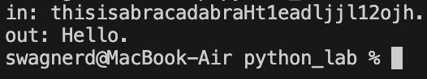

# laboratoriti

# Лабораторная работа 1
## Задание 1
```python
name = input('Имя: ')
age = int(input('Возраст: '))
print(f'Привет, {name}! Через год тебе будет {age+1}.')
```


## Задание 2 
```python
a = input('a: ')
b = input('b: ')
a = float(a.replace(',','.'))
b = float(b.replace(',','.'))
print(f'sum={a+b}; avg={((a+b)/2):.2f}')
```


## Задание 3
```python
price = int(input('price='))
discount = int(input('discount='))
vat = int(input('vat='))
base = price * (1-discount/100)
vat_amount = base * (vat/100)
total = base + vat_amount
print(f'База после скидки: {base:.2f} ₽')
print(f'НДС: {vat_amount:20.2f} ₽')
print(f'Итого к оплате: {total:10.2f} ₽')
```


## Задание 4
```python
m = int(input('Минуты: '))
print(f'{m//60}:{m%60:02d}')
```


## Задание 5
```python
fio = input('ФИО: ')
fio = fio.replace(' ','')
iniciali = ''
for i in range(len(fio)):
    bukva = fio[i]
    if bukva.isupper():
        iniciali += bukva
    else:
        continue
print(f'Инициалы: {iniciali}.')
print(f'Длина (символов): {len(fio)+2}')
```


## Задание 6 
```python
kolich = int(input('in_1: '))
ochno_ = 0
zaochno_ = 0
for i in range(kolich):
    ychastnik = input(f'in_{i+2}: ')
    if 'True' in ychastnik:
        ochno_ = ochno_+1
    else:
        zaochno_ = zaochno_ +1
print(f'out: {ochno_} {zaochno_}')
```


## Задание 7
```python
vxod = input('in: ')
itog_ = ''
index_1 = 0 
index_2 = 0

for i in range(len(vxod)):
    if vxod[i].isupper():
        index_1 = i 
        break
    else:
        continue 
for i in range(len(vxod)):
    if vxod[i] in '0123456789':
        index_2 = i+1
        break
    else:
        continue
shag = index_2 - index_1
for i in range(index_1,len(vxod),shag):
    itog_+=vxod[i]
print(f'out: {itog_}')
```


# Лабораторная работа 2
## Задание 1
```python
def min_max(nums: list[float | int]) -> tuple[float | int, float | int]:
    if not nums:
        return 'VallueError'
    return (min(nums), max(nums))
print(min_max([3, -1, 5, 5, 0]))
print(min_max([42]))
print(min_max([-5, -2, -9]))
print(min_max([]))
print(min_max([1.5, 2, 2.0, -3.1]))

print('#'*18)
print('')
def unique_sorted(nums: list[float | int]) -> list[float | int]:
    return sorted(set(nums))
print(unique_sorted([3, 1, 2, 1, 3]))
print(unique_sorted([]))
print(unique_sorted([-1, -1, 0, 2, 2]))
print(unique_sorted([1.0, 1, 2.5, 2.5, 0]))
print('#'*18)
print('')
def flatten(mat: list[list | tuple]) -> list:
    res = []
    for row in mat:
        if not isinstance(row,(list,tuple)):
            return 'TypeError'
        if isinstance(row,(list,tuple)):
            res.extend(row)
    return res
print(flatten([[1, 2], [3, 4]]))
print(flatten([[1, 2], (3, 4, 5)]))  
print(flatten([[1], [], [2, 3]]))  
print(flatten([[1, 2], "ab"])) 
print('#'*18)       
```


## Задание 2
```python
def transpose(mat: list[list[float | int]]) -> list[list]:
    if len(mat) == 0:
        return []
    rvan = [len(x) for x in mat]
    if len(set(rvan))!=1:
        return 'VallueError'
    return [list(col) for col in zip(*mat)]
print(transpose([[1, 2, 3]]))
print(transpose([[1], [2], [3]]))
print(transpose([[1, 2], [3, 4]]))
print(transpose([]))
print(transpose([[1, 2], [3]]))
print('#'*18)
print('')

def row_sums(mat: list[list[float | int]]) -> list[float]:
    rvan = [len(x) for x in mat]
    if len(set(rvan)) != 1:
        return 'ValueError'
    res = []
    for i in range(len(mat)):
        summ = 0
        res.append(sum(mat[i]))
    return res
print(row_sums([[1, 2, 3], [4, 5, 6]]))
print(row_sums([[-1, 1], [10, -10]]))
print(row_sums([[0, 0], [0, 0]]))
print(row_sums([[1, 2], [3]]))
print('#'*18,' '*18)
print('')

def col_sums(mat: list[list[float | int]]) -> list[float]:
    rvan = [len(x) for x in mat]
    if len(set(rvan)) != 1:
        return 'ValueError'
    res = []
    for i in range(len(mat[0])):
        s = 0
        for j in range(len(mat)):
            s+=mat[j][i]
        res.append(s)       
    return res
print(col_sums([[1, 2, 3], [4, 5, 6]]))
print(col_sums([[-1, 1], [10, -10]]))
print(col_sums([[0, 0], [0, 0]]))
print(col_sums([[1, 2], [3]]))
print('#'*18)
```

## Задание 3
```python
def format_record(rec: tuple[str, str, float]) -> str:
    if len(rec) != 3:
        return 'ValueError' #Отсутствуют элементы 
    fio, group,gpa = rec
    if  group == '' or gpa > 5 or gpa < 0 or fio == '':
        return 'ValueError' #Неверные данные(0<gpa<5)
    if not isinstance(gpa,(int,float)) or not isinstance(group,str) or not isinstance(fio,str):
        return 'TypeError' #Неверный тип данных  
    stroka = ''
    inic = fio.strip().split()
    if len(inic) == 3:
        inic = str(inic[0][0].upper()+inic[0][1::] + ' ' +(inic[1])[:1:].upper()+'.'+ (inic[2])[:1:].upper()+'.')
    else:
        inic = str(inic[0][0].upper()+inic[0][1::]  +' '+(inic[1])[:1:]+'.')    
    grupa = rec[1]
    ball = f'{gpa:.2f}'
    stroka = inic + ', гр. ' + grupa + ', GPA ' + ball 
    return stroka
print(format_record(("Иванов Иван Иванович", "BIVT-25", 4.6)))
print(format_record(("Петров Пётр", "IKBO-12", 5.0)))
print(format_record(("Петров Пётр Петрович", "IKBO-12", 5.0)))
print(format_record(("  сидорова  анна   сергеевна ", "ABB-01", 3.999)))
print(format_record(("IKBO-12", 5.0)))
print(format_record(("Петров Пётр Петрович", 5,4.0)))  
print('#'*18)
```

